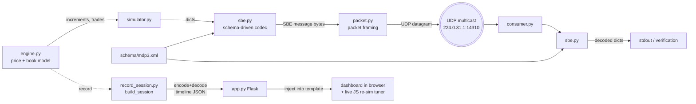

# Architecture

A technical tour of the CME MDP 3.0 ES market-data simulator: how bytes are
built, how the price/book model works, and how the dashboard stays honest.

---

## 1. Goal & approach

Emulate the **CME Group MDP 3.0** market-data feed for the **E-mini S&P 500 (ES)**
future closely enough that a real feed handler could decode the packets. Two
principles drive the design:

1. **Schema-driven encoding.** The exact wire layout lives in an SBE schema
   (`schema/mdp3.xml`), not in imperative code. The codec reads the schema and
   encodes/decodes accordingly, so swapping in CME's official
   `templates_FixBinary.xml` changes the wire format without touching Python.
2. **Prove the wire.** Nothing trusts engine internals. The consumer and the
   visualization both reconstruct the market **from the decoded bytes**, so if
   the encoding were wrong, the output would be wrong.

---

## 2. Data flow



Two paths share the same engine and codec:

- **Live feed:** `simulator.py` → SBE encode → packet frame → UDP multicast →
  `consumer.py` decodes and verifies.
- **Visualization:** `record_session.py` runs the same steps, encodes to SBE,
  **decodes back**, and records a timeline. `app.py` injects it into the
  dashboard template. The in-page tuner re-simulates client-side for instant
  what-if exploration.

---

## 3. Modules

| Module | Responsibility |
|--------|----------------|
| `schema/mdp3.xml` | SBE `messageSchema`: composites, enums, sets, messages, repeating groups. The source of truth for the wire layout. |
| `sbe.py` | Generic, schema-driven SBE codec. Parses the schema into typed objects, then encodes/decodes messages (root block + repeating groups) purely from that model. |
| `packet.py` | MDP transport framing: the 12-byte Binary Packet Header and per-message 2-byte size prefixes. |
| `engine.py` | The `MarketEngine`: bounded random walk of the ES price, book maintenance, and generation of incremental MD entries + trades. |
| `simulator.py` | Wires engine → codec → packet → UDP multicast socket. CLI-configurable. |
| `consumer.py` | Joins the multicast group, parses packets, decodes every SBE message, prints/validates. Detects sequence gaps. |
| `record_session.py` | `build_session()` — runs a session, encodes+decodes, returns a compact timeline dict. Reused by the app and build script. |
| `app.py` | Flask host. Generates a session per request and serves the dashboard; `/api/session` exposes the raw JSON. |
| `build_dashboard.py` | Bakes a static, serverless `dashboard.html` from the template + a session. |
| `viz_template.html` | The dashboard UI (DOM ladder, price chart, tape, wire view) + the live dynamics tuner (a JS port of the model). |
| `test_roundtrip.py` | Asserts encode → bytes → decode is exact, including price scaling and packet framing. |

---

## 4. Wire format

Everything is **little-endian**. A UDP datagram (one "packet") is:

### 4.1 Binary Packet Header (12 bytes)

| Offset | Field | Type | Notes |
|-------:|-------|------|-------|
| 0 | `MsgSeqNum` | uint32 | Packet sequence number, increments per packet (gap detection). |
| 4 | `SendingTime` | uint64 | Nanoseconds since the Unix epoch. |

### 4.2 Message framing (repeats)

Each message in the packet is preceded by its size:

| Field | Type | Notes |
|-------|------|-------|
| `MsgSize` | uint16 | Byte length of the SBE message that follows (header + body). |
| *SBE message* | … | See below. |

### 4.3 SBE message header (8 bytes)

| Offset | Field | Type |
|-------:|-------|------|
| 0 | `blockLength` | uint16 |
| 2 | `templateId` | uint16 |
| 4 | `schemaId` | uint16 |
| 6 | `version` | uint16 |

The **root block** (`blockLength` bytes) holds the message's fixed fields at
fixed offsets, with padding to `blockLength`. Repeating groups follow the block.

### 4.4 Repeating-group dimension (3 bytes) — CME-specific

CME overrides the SBE default (which uses uint16 for `numInGroup`):

| Field | Type | Notes |
|-------|------|-------|
| `blockLength` | uint16 | Size of **each** group entry's block. |
| `numInGroup` | uint8 | Number of entries. |

Each entry is exactly `blockLength` bytes (fields at fixed offsets + padding).

### 4.5 Prices

`PRICE` / `PRICENULL` are `Decimal` composites: an **int64 mantissa** with a
**constant exponent of -7** (the exponent is metadata, not on the wire). So a
displayed price `P` is stored as `round(P × 10⁷)`, and `PRICENULL` uses the
null sentinel `0x7FFFFFFFFFFFFFFF`.

```
5012.00  ->  mantissa 50120000000
5000.25  ->  mantissa 50002500000
```

### 4.6 Worked example (a real packet from this sim)

```
0600 0000  00c6 6259 08b3 cc18  9602  0b00 2e00 0100 0d00  ...
└─MsgSeqNum┘ └─── SendingTime ──┘ MsgSize └blk┘ └tpl┘ └sch┘ └ver┘
   = 6         = 1787000000600000000  = 662  = 11  = 46  = 1  = 13
```

- Packet sequence **6**, sent at `1787000000600000000` ns.
- One message of **662** bytes: template **46** (`MDIncrementalRefreshBook`),
  schema **1**, version **13**, root `blockLength` **11**.
- After the 11-byte block comes the group dimension `2000 14` →
  entry `blockLength` **32**, `numInGroup` **20**.
- The first entry's price mantissa `0082 62ab 0b00 0000` = `50120000000` →
  **5012.00**.

---

## 5. The SBE codec (`sbe.py`)

`Schema(path)` parses the XML once into typed descriptors:

- **`Primitive`** — a primitive type (size, presence, null/const value).
- **`Composite`** — an ordered list of members. `wire_size` excludes constant
  members. A composite is treated as a **decimal** when it has `mantissa` +
  `exponent`, which triggers float ↔ mantissa scaling.
- **`Enum`** — `uint8`- or `char`-encoded, with name↔value maps (so `"Bid"` and
  `'0'` are interchangeable on encode).
- **`SetType`** — a bitset (e.g. `MatchEventIndicator`); encodes a list of
  choice names to bits.
- **`Message`** / **`Group`** — fields at explicit offsets, plus nested groups.

`encode_message(name, root, entries)` writes the SBE header, lays out the root
block, then writes the group dimension + each entry. `decode_message(buf)`
reverses it and returns `{template, id, root, groups}`. The codec is generic —
adding a message or field is a schema edit, not a code change.

**Namespace note:** only `<sbe:messageSchema>` and `<sbe:message>` carry the
`sbe:` prefix; the type system elements (`types`, `composite`, `enum`, `set`,
`field`, `group`, …) are unprefixed. The parser looks them up accordingly.

---

## 6. Price & book model (`engine.py`)

ES facts: tick **0.25**, **$12.50** per tick.

### 6.1 Price path

The engine walks the **best bid** on the tick grid; the best offer sits exactly
one tick above, so the book is never locked or crossed and the mid is the
midpoint. Each step, in tick space:

```
drift  = -θ · (best_bid − center) / tick        # Ornstein–Uhlenbeck reversion
shock  =  N(0, σ)                                # gaussian, σ in ticks
if rand() < jump_prob:                           # occasional gap move
    shock += ±|N(jump_size, 0.3·jump_size)|
best_bid += round(drift + shock) · tick
```

Moves are quantized to whole ticks and the price **reflects** off the band so it
always stays inside `[low, high]`. Knobs:

| Knob | Symbol | Effect |
|------|:------:|--------|
| `volatility` | σ | Std-dev of each shock, in ticks. |
| `reversion` | θ | Strength of the pull toward band center. |
| `jump_prob` | — | Per-step probability of a gap move. |
| `jump_size` | — | Mean magnitude of a jump, in ticks. |

### 6.2 Book & increments

Each step rebuilds the target book: `depth` levels per side, one tick apart,
with size fattening deeper in the book plus noise, and an order count per level.
The engine diffs the previous book against the target and emits MD entries with
`MDUpdateAction` of **New** (level appeared), **Change** (size/orders differ), or
**Delete** (level left the book / band). Because sizes are re-drawn each step,
most levels report **Change** — matching the churn of a real book.

### 6.3 Trades

With ~35% probability per step a marketable order crosses the touch, producing a
`MDIncrementalRefreshTradeSummary` entry at the best bid/offer with an
`AggressorSide` of Buy or Sell and an exponentially-distributed size.

---

## 7. Visualization

### 7.1 Recorded timeline

`build_session()` returns:

```jsonc
{
  "meta":  { channel, product, securityId, low, high, center, tick,
             tickValue, depth, schemaId, schemaVersion, steps, totalBytes, multicast },
  "sampleHex":     "…",     // one real packet, hex — drives the annotated wire view
  "sampleDecoded": [ … ],   // that packet, decoded from the bytes
  "frames": [ { seq, ts, mid, bestBid, bestOffer, bytes, nMsgs,
                bids:[[px,size,orders]…], offers:[…], trades:[[px,size,side]…] } … ]
}
```

Every field in `frames` was produced by **decoding the encoded bytes**, so the
ladder, tape, and chart reflect the wire, not the engine's private state.

### 7.2 Live tuner

The dashboard contains a faithful **JavaScript port of `engine.py`** (same OU +
jump math, reflection, book diff, and trade logic; a seeded `mulberry32` RNG with
Box–Muller for gaussians). Moving a slider re-runs the whole feed in the browser
in a few milliseconds and redraws everything, including exact packet byte counts
derived from the framing formula:

```
packet = 12 + Σ over messages ( 2 + 8 + 11 + 3 + 32·entries )
         └hdr┘        └size┘ └sbe┘ └blk┘└dim┘ └── entries ──┘
```

The JS model is a **preview** of the dynamics; the Python simulator remains
authoritative (real SBE bytes on the wire). The two use different RNG algorithms,
so a seed won't produce byte-identical paths — but the *parameters* map exactly,
which is why **Copy simulator command** emits the matching `simulator.py` flags.

---

## 8. Extending it

- **Production parity:** replace `schema/mdp3.xml` with CME's official
  `templates_FixBinary.xml`. The codec adapts; add any new message names you emit.
- **New message type:** add a `<sbe:message>` to the schema, then build the dict
  and call `encode_message(...)`. No codec changes.
- **New dynamics:** add the knob to `MarketEngine.__init__` and the step math,
  expose a CLI flag in `simulator.py` / `record_session.py`, and (optionally)
  mirror it in the JS `simulate()` + a slider in `viz_template.html`.
- **Snapshot/recovery:** add `SnapshotFullRefreshOrderBook` (template 52) on a
  separate cadence, and A/B feed arbitration in the consumer.

---

## 9. Fidelity: faithful vs. simplified

**Faithful:** little-endian SBE; packet header + size-prefixed framing; 8-byte
SBE header; CME's 3-byte group dimension; int64 mantissa prices at exponent -7;
`MDUpdateAction` / `MDEntryType` / `AggressorSide` enums; `MatchEventIndicator`
bitset; templates 46 / 48 / 30; multicast defaults from CME channel 310.

**Simplified (by design):** the schema is a hand-authored subset of CME's, not
the full production template; the book is Market-by-Price only (no MBO order
IDs); no implied/spread markets, security definitions, or snapshot/recovery
channel; the price process is a statistical model, not real order-flow matching.
Drop in the official schema and add messages to close the gap.
