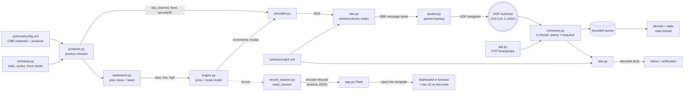

# Architecture

A technical tour of the CME MDP 3.0 ES market-data simulator: how bytes are
built, how the price/book model works, and how the dashboard stays honest.

---

## 1. Goal & approach

Emulate the **CME Group MDP 3.0** market-data feed closely enough that a real
feed handler could decode the packets — for the E-mini S&P 500 by default, or any
futures product in CME's channel configuration. Two principles drive the design:

1. **Schema-driven encoding.** The exact wire layout lives in an SBE schema
   (`schema/mdp3.xml`), not in imperative code. The codec reads the schema and
   encodes/decodes accordingly, so swapping in CME's official
   `templates_FixBinary.xml` changes the wire format without touching Python.
2. **Prove the wire.** Nothing trusts engine internals. The consumer and the
   visualization both reconstruct the market **from the decoded bytes**, so if
   the encoding were wrong, the output would be wrong.

A third rule follows from the first: **market structure is data, not code.**
Channels, multicast feeds and product listings come from CME's own `config.xml`;
tick sizes, tick values and expiry cycles live in one table in `contracts.py`.
Nothing about ES is hardcoded in the engine or the transport.

---

## 2. Data flow



`products.py` runs first on both paths: it resolves the product (ES by default)
into a channel, multicast feed, security id and tick size, plus the front-month
contract. `settlement.py` then resolves the opening price (that product's prior
close unless one was passed) and the band the walk runs in, and both are handed
to the engine.

Two paths share the same engine and codec:

- **Live feed:** `simulator.py` → SBE encode → packet frame → UDP multicast →
  `consumer.py` decodes and verifies.
- **Visualization:** `record_session.py` runs the same steps, encodes to SBE,
  **decodes back**, and records a timeline. `app.py` injects it into the
  dashboard template. The in-page tuner re-simulates client-side for instant
  what-if exploration.

---

## 3. Modules

| Module | Responsibility |
|--------|----------------|
| `schema/mdp3.xml` | SBE `messageSchema`: composites, enums, sets, messages, repeating groups. The source of truth for the wire layout. |
| `sbe.py` | Generic, schema-driven SBE codec. Parses the schema into typed objects, then encodes/decodes messages (root block + repeating groups) purely from that model. |
| `packet.py` | MDP transport framing: the 12-byte Binary Packet Header and per-message 2-byte size prefixes. |
| `engine.py` | The `MarketEngine`: bounded random walk of the price, book maintenance, and generation of incremental MD entries + trades. Tick size and tick value are per-instance. |
| `contracts.py` | Contract economics per product (tick, tick value, contract cycle, expiry rule, reference level) and the date arithmetic that picks a front month. |
| `products.py` | Parses CME's `config.xml` and joins it to `contracts.py`, yielding a `Product` with its channel, multicast feeds, security id and front-month contract. |
| `settlement.py` | Resolves where the walk opens: the product's prior close (fetched + cached, stdlib only) and the band derived around it. `prefetch()` warms many symbols concurrently. |
| `ptp.py` | IEEE 1588 receive timestamping: kernel capture where available, TAI formatting, the 10-byte on-wire Timestamp, and latency statistics. |
| `pyver.py` | The Python 3.14 floor, enforced by every entry point. |
| `simulator.py` | Wires engine → codec → packet → UDP multicast socket. CLI-configurable. |
| `consumer.py` | Joins the multicast group, parses packets, decodes every SBE message, prints/validates. Detects sequence gaps. |
| `record_session.py` | `build_session()` — runs a session, encodes+decodes, returns a compact timeline dict. Reused by the app and build script. |
| `app.py` | Flask host. Generates a session per request and serves the dashboard; `/api/session` exposes the raw JSON. |
| `build_dashboard.py` | Bakes a static, serverless `dashboard.html` from the template + a session. |
| `viz_template.html` | The dashboard UI (DOM ladder, price chart, tape, wire view) + the live dynamics tuner (a JS port of the model). |
| `test_roundtrip.py` | Asserts encode → bytes → decode is exact, including price scaling and packet framing. |

---

## 4. Wire format

Everything is **little-endian**. A UDP datagram (one "packet") is:

### 4.1 Binary Packet Header (12 bytes)

| Offset | Field | Type | Notes |
|-------:|-------|------|-------|
| 0 | `MsgSeqNum` | uint32 | Packet sequence number, increments per packet (gap detection). |
| 4 | `SendingTime` | uint64 | Nanoseconds since the Unix epoch. |

### 4.2 Message framing (repeats)

Each message in the packet is preceded by its size:

| Field | Type | Notes |
|-------|------|-------|
| `MsgSize` | uint16 | Byte length of the SBE message that follows (header + body). |
| *SBE message* | … | See below. |

### 4.3 SBE message header (8 bytes)

| Offset | Field | Type |
|-------:|-------|------|
| 0 | `blockLength` | uint16 |
| 2 | `templateId` | uint16 |
| 4 | `schemaId` | uint16 |
| 6 | `version` | uint16 |

The **root block** (`blockLength` bytes) holds the message's fixed fields at
fixed offsets, with padding to `blockLength`. Repeating groups follow the block.

### 4.4 Repeating-group dimension (3 bytes) — CME-specific

CME overrides the SBE default (which uses uint16 for `numInGroup`):

| Field | Type | Notes |
|-------|------|-------|
| `blockLength` | uint16 | Size of **each** group entry's block. |
| `numInGroup` | uint8 | Number of entries. |

Each entry is exactly `blockLength` bytes (fields at fixed offsets + padding).

### 4.5 Prices

`PRICE` / `PRICENULL` are `Decimal` composites: an **int64 mantissa** with a
**constant exponent of -7** (the exponent is metadata, not on the wire). So a
displayed price `P` is stored as `round(P × 10⁷)`, and `PRICENULL` uses the
null sentinel `0x7FFFFFFFFFFFFFFF`.

```
5012.00  ->  mantissa 50120000000
5000.25  ->  mantissa 50002500000
```

### 4.6 Worked example (a real packet from this sim)

```
0600 0000  00c6 6259 08b3 cc18  9602  0b00 2e00 0100 0d00  ...
└─MsgSeqNum┘ └─── SendingTime ──┘ MsgSize └blk┘ └tpl┘ └sch┘ └ver┘
   = 6         = 1787000000600000000  = 662  = 11  = 46  = 1  = 13
```

- Packet sequence **6**, sent at `1787000000600000000` ns.
- One message of **662** bytes: template **46** (`MDIncrementalRefreshBook`),
  schema **1**, version **13**, root `blockLength` **11**.
- After the 11-byte block comes the group dimension `2000 14` →
  entry `blockLength` **32**, `numInGroup` **20**.
- The first entry's price mantissa `0082 62ab 0b00 0000` = `50120000000` →
  **5012.00**.

---

## 5. The SBE codec (`sbe.py`)

`Schema(path)` parses the XML once into typed descriptors:

- **`Primitive`** — a primitive type (size, presence, null/const value).
- **`Composite`** — an ordered list of members. `wire_size` excludes constant
  members. A composite is treated as a **decimal** when it has `mantissa` +
  `exponent`, which triggers float ↔ mantissa scaling.
- **`Enum`** — `uint8`- or `char`-encoded, with name↔value maps (so `"Bid"` and
  `'0'` are interchangeable on encode).
- **`SetType`** — a bitset (e.g. `MatchEventIndicator`); encodes a list of
  choice names to bits.
- **`Message`** / **`Group`** — fields at explicit offsets, plus nested groups.

`encode_message(name, root, entries)` writes the SBE header, lays out the root
block, then writes the group dimension + each entry. `decode_message(buf)`
reverses it and returns `{template, id, root, groups}`. The codec is generic —
adding a message or field is a schema edit, not a code change.

**Namespace note:** only `<sbe:messageSchema>` and `<sbe:message>` carry the
`sbe:` prefix; the type system elements (`types`, `composite`, `enum`, `set`,
`field`, `group`, …) are unprefixed. The parser looks them up accordingly.

---

## 6. Product selection (`products.py`, `contracts.py`)

Two sources, joined on the product code:

| Source | Supplies | Why there |
|--------|----------|-----------|
| `schema/config.xml` | channel id + label, product listings, multicast connections (ip, port, type, feed) | CME's own file — swap in the real download and addresses are production-accurate |
| `contracts.py` | tick size, tick value, contract cycle, expiry rule, Yahoo symbol, security id | CME's config.xml does not carry contract economics; they are rulebook facts |

Parsing is deliberately tolerant so CME's real file drops in unchanged. CME
nests fields (`<type feed-type="I">Incremental</type>`, `<feed>A</feed>`,
`<group code="ES"/>`); the parser reads each field from a child element *or* an
attribute.

Two filters matter:

- **Futures only.** A product code is listed on its futures channel and on the
  options channels that reference it — `ES` appears on 310, 311 and 323. Only
  channels whose label contains "Futures" and not "Options" are considered, so
  `ES` resolves to 310 and its real `224.0.31.1:14310` incremental feed A.
- **Multicast only.** Historical-replay connections carry a port but no
  multicast `<ip>`; they are skipped.

Products with no `ContractSpec` are filtered out of the chooser rather than
half-supported — with CME's real file that is 2,210 futures products down to the
29 with economics.

### Front month

`front_month()` walks the product's contract months forward and returns the first
whose last trade date is on or after today, so the roll happens the day *after*
expiry. Expiry rules are shape-faithful to the rulebook but holiday-blind:

| Rule | Products | Last trade |
|------|----------|-----------|
| `third_friday` | equity index | 3rd Friday of the contract month |
| `fx` | FX | 2 business days before the 3rd Wednesday |
| `treasury` | ZT–UB | 7 business days before month end |
| `grain` | ZC–ZL | business day before the 15th |
| `crude` | CL | 3 business days before the 25th of the *prior* month |
| `prior_month_end` | NG, RB, HO | last business day of the prior month |
| `metal` | GC, SI, HG, PL | 3rd-to-last business day of the prior month |

---

## 7. Price & book model (`engine.py`, `settlement.py`)

Tick size and tick value are per-`MarketEngine`, supplied by the selected
product; they default to ES (tick **0.25**, **$12.50** per tick). Prices are
snapped with `round_to_tick(px, tick)`, whose outer rounding clears float fuzz —
a Japanese Yen tick is 0.0000005, fine enough that `n * tick` otherwise lands
off-grid.

### 7.1 Opening price

The walk opens at `start` — by default the **previous session's close**, which
`settlement.py` resolves before the engine is constructed:

```
explicit --start ──────────────────────────────► start
        else prior close (Yahoo ES=F, cached) ──► start
        else (offline, no cache) ──────────────► None ─► open at band center
```

`resolve_start_band()` then fills in whichever of `low`/`high` was not supplied,
as a `--band`-wide window centered on the opening price, and reconciles the two:

| Situation | Result |
|-----------|--------|
| explicit `--start` outside the band | clamped into the band, `clamped=True` |
| *prior close* outside an explicit band | dropped; opens at center, `outOfBand=True` |
| neither a start price nor a cache | band falls back to `[5000, 5025]`, opens at center |

The opening price becomes the opening **best bid**, so the opening mid sits half
a tick above it — a one-tick-wide market has no mid on the tick grid. The band
center remains the mean-reversion anchor either way, so a walk that opens away
from the center drifts back toward it.

The lookup is stdlib-only (`urllib`), times out in 5s, caches to
`.prior_close_cache.json` for 4 hours, and never raises: a failed fetch degrades
to the cache (flagged `stale`), and no cache degrades to a center open.

> CME's own settlements service is not used — its Data Terms of Use prohibit
> automated access. The Yahoo figure is a consolidated close, not the official
> CME settlement.

### 7.2 Price path

The engine walks the **best bid** on the tick grid; the best offer sits exactly
one tick above, so the book is never locked or crossed and the mid is the
midpoint. Each step, in tick space:

```
drift  = -θ · (best_bid − center) / tick        # Ornstein–Uhlenbeck reversion
shock  =  N(0, σ)                                # gaussian, σ in ticks
if rand() < jump_prob:                           # occasional gap move
    shock += ±|N(jump_size, 0.3·jump_size)|
best_bid += round(drift + shock) · tick
```

Moves are quantized to whole ticks and the price **reflects** off the band so it
always stays inside `[low, high]`. Knobs:

| Knob | Symbol | Effect |
|------|:------:|--------|
| `volatility` | σ | Std-dev of each shock, in ticks. |
| `reversion` | θ | Strength of the pull toward band center. |
| `jump_prob` | — | Per-step probability of a gap move. |
| `jump_size` | — | Mean magnitude of a jump, in ticks. |

### 7.3 Book & increments

Each step rebuilds the target book: `depth` levels per side, one tick apart,
with size fattening deeper in the book plus noise, and an order count per level.
The engine diffs the previous book against the target and emits MD entries with
`MDUpdateAction` of **New** (level appeared), **Change** (size/orders differ), or
**Delete** (level left the book / band). Because sizes are re-drawn each step,
most levels report **Change** — matching the churn of a real book.

### 7.4 Trades

With ~35% probability per step a marketable order crosses the touch, producing a
`MDIncrementalRefreshTradeSummary` entry at the best bid/offer with an
`AggressorSide` of Buy or Sell and an exponentially-distributed size.

---

## 8. Receive path & timestamping (`consumer.py`, `ptp.py`)

### 8.1 Two threads, one queue

```
 rx thread                    bounded queue                 main thread
 ─────────                    ─────────────                 ───────────
 recvmsg  ──►  timestamp  ──►  put_nowait  ──►  get  ──►  parse → decode → stats
    ▲                              │
    └──── never blocked ───────────┘  full ⇒ drop + count
```

The receive thread does nothing but `recvmsg`, stamp and enqueue. This is not
decoration: while a single-threaded handler is decoding it is not receiving, so
the next packet either waits in the socket buffer — inflating the latency that
packet will later appear to have — or is dropped by the kernel. Splitting them
means the timestamp records when the packet *arrived*, not when the decoder got
round to it.

The queue is bounded and overruns are counted rather than absorbed: an unbounded
queue would turn a slow decoder into unbounded memory growth and silently
falsify the latency distribution. `--no-threads` runs the inline path for
comparison.

`recvmsg` releases the GIL, so this split helps on a stock interpreter; on a
free-threaded 3.14 build the decode side runs genuinely in parallel. The banner
reports which build is running.

### 8.2 Getting a timestamp

Python does not export the timestamping socket constants on every platform, so
`ptp.py` carries them by value and probes in order: `SO_TIMESTAMPNS` (Linux,
`timespec`, nanoseconds) → `SO_TIMESTAMP` (BSD/macOS `timeval` with a 4-byte
`tv_usec`, Linux with 8, microseconds) → a userspace clock read. Whatever it
gets, `ClockSource.describe()` states the mechanism, whether it came from the
kernel, and the resolution actually measured on this host — the advertised
option means little if the OS clock only advances in microsecond steps.

When nothing is available, `synthesize_ancdata()` fabricates the exact control
message the kernel would have attached. The parsing path is then identical on a
machine that cannot timestamp, which is how the tests cover it everywhere — and
the output is labelled `FABRICATED` so a synthesized capture is never mistaken
for a real one.

### 8.3 PTP semantics

PTP counts from the 1970 epoch on the **TAI** timescale, which leads UTC by a
whole number of leap seconds (37 since 2017). `format_ptp()` applies that offset,
and `encode_ptp_timestamp()` produces the 10-byte IEEE 1588 `Timestamp`: 48-bit
seconds plus 32-bit nanoseconds, big-endian.

**This is PTP formatting and measurement, not PTP sync.** No grandmaster
disciplines this host's clock. Transit — `rx timestamp − sendingTime` — is only
meaningful when both ends share a time source; across unsynchronized hosts it is
dominated by clock offset, and the consumer says so when the median goes
negative.

---

## 9. Visualization

### 9.1 Recorded timeline

`build_session()` returns:

```jsonc
{
  "meta":  { channel, channelLabel, product, productLabel, group, exchange,
             symbol, contract, expiry, securityId, multicast,
             low, high, center, band,
             start, startSource, closeDate, closeSymbol, startStale,
             tick, tickValue, decimals, depth,
             schemaId, schemaVersion, steps, totalBytes,
             products: [ {code, label, group, exchange, channel, symbol} … ] },
  "sampleHex":     "…",     // one real packet, hex — drives the annotated wire view
  "sampleDecoded": [ … ],   // that packet, decoded from the bytes
  "frames": [ { seq, ts, mid, bestBid, bestOffer, bytes, nMsgs,
                bids:[[px,size,orders]…], offers:[…], trades:[[px,size,side]…] } … ]
}
```

`meta.products` is the chooser's catalog, and `meta.decimals` (derived from the
tick) drives every price the dashboard prints — at two decimals a Yen ladder
would collapse every level onto one row.

`startSource` is `explicit`, `priorClose`, `fallback`, or `center`, and tells the
dashboard how to label the opening price: with `priorClose` it draws the close as a chip,
as a dashed reference line on the chart, and as the baseline for the big header
delta (`+0.38 vs prev close`).

Every field in `frames` was produced by **decoding the encoded bytes**, so the
ladder, tape, and chart reflect the wire, not the engine's private state.

### 9.2 Live tuner

The dashboard contains a faithful **JavaScript port of `engine.py`** (same OU +
jump math, reflection, book diff, and trade logic; a seeded `mulberry32` RNG with
Box–Muller for gaussians). Moving a slider re-runs the whole feed in the browser
in a few milliseconds and redraws everything, including exact packet byte counts
derived from the framing formula:

```
packet = 12 + Σ over messages ( 2 + 8 + 11 + 3 + 32·entries )
         └hdr┘        └size┘ └sbe┘ └blk┘└dim┘ └── entries ──┘
```

The JS model is a **preview** of the dynamics; the Python simulator remains
authoritative (real SBE bytes on the wire). The two use different RNG algorithms,
so a seed won't produce byte-identical paths — but the *parameters* map exactly,
which is why **Copy simulator command** emits the matching `simulator.py` flags.

---

## 10. Extending it

- **Production parity:** replace `schema/mdp3.xml` with CME's official
  `templates_FixBinary.xml`. The codec adapts; add any new message names you emit.
- **New message type:** add a `<sbe:message>` to the schema, then build the dict
  and call `encode_message(...)`. No codec changes.
- **New dynamics:** add the knob to `MarketEngine.__init__` and the step math,
  expose a CLI flag in `simulator.py` / `record_session.py`, and (optionally)
  mirror it in the JS `simulate()` + a slider in `viz_template.html`.
- **Snapshot/recovery:** add `SnapshotFullRefreshOrderBook` (template 52) on a
  separate cadence, and A/B feed arbitration in the consumer.
- **Hardware timestamps:** on Linux with a PTP-capable NIC, add
  `SO_TIMESTAMPING` (37) with `SOF_TIMESTAMPING_RX_HARDWARE` to the probe list in
  `ptp.py`; it yields a three-`timespec` control message. Everything downstream
  already works in nanoseconds.
- **New product:** add a `ContractSpec` to `contracts.py` (tick, tick value,
  contract cycle, expiry rule, Yahoo symbol). Its channel and multicast feed come
  from `config.xml` automatically — nothing else to wire.
- **Real channel addresses:** download CME's `config.xml` to `schema/config.xml`;
  the committed extract is only a fallback.

---

## 11. Fidelity: faithful vs. simplified

**Faithful:** little-endian SBE; packet header + size-prefixed framing; 8-byte
SBE header; CME's 3-byte group dimension; int64 mantissa prices at exponent -7;
`MDUpdateAction` / `MDEntryType` / `AggressorSide` enums; `MatchEventIndicator`
bitset; templates 46 / 48 / 30; channels, multicast feeds and product listings
read from CME's own `config.xml`; real tick sizes and tick values per product.

**Simplified (by design):** the schema is a hand-authored subset of CME's, not
the full production template; the book is Market-by-Price only (no MBO order
IDs); no implied/spread markets, security definitions, or snapshot/recovery
channel; the price process is a statistical model, not real order-flow matching.
Security IDs are synthetic rather than read from the definition feed, expiry
rules ignore exchange holidays, and treasuries are quoted decimally rather than
in 32nds. Timestamps are PTP-formatted but not PTP-disciplined, and are software
timestamps — kernel where the platform allows, never NIC hardware. Drop in the official schema and add messages to close the gap.
